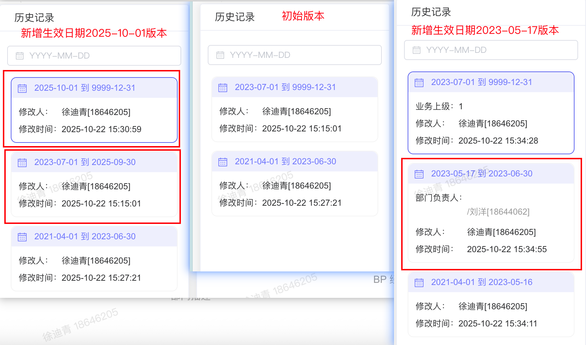
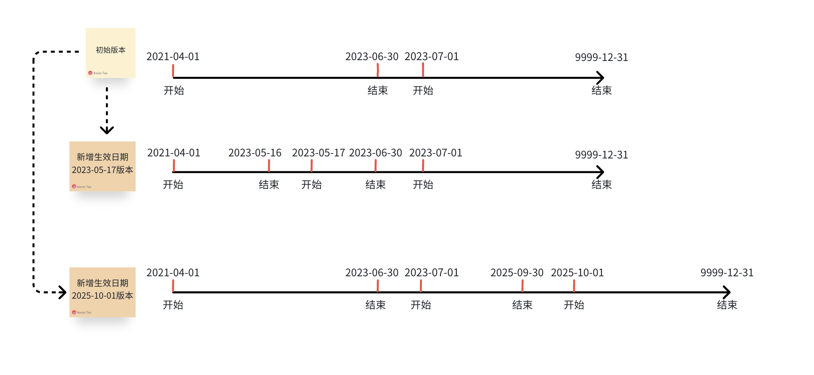
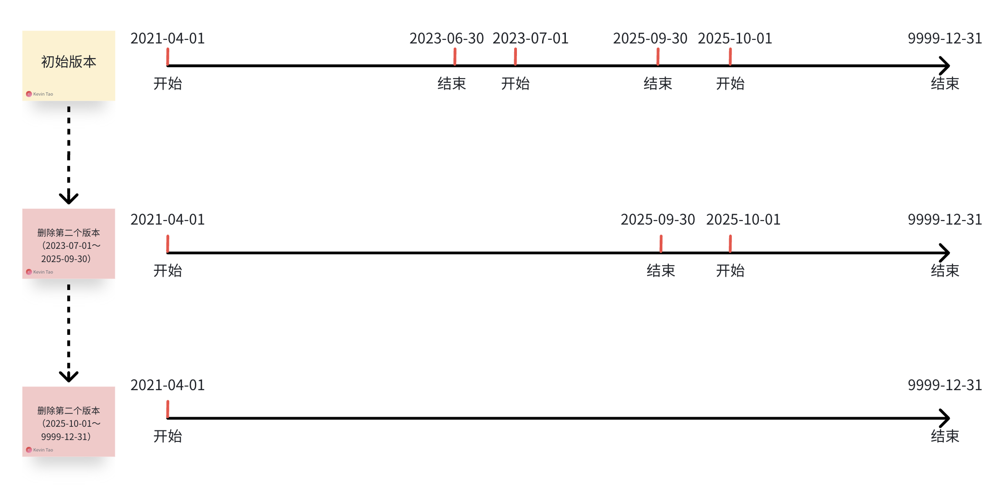
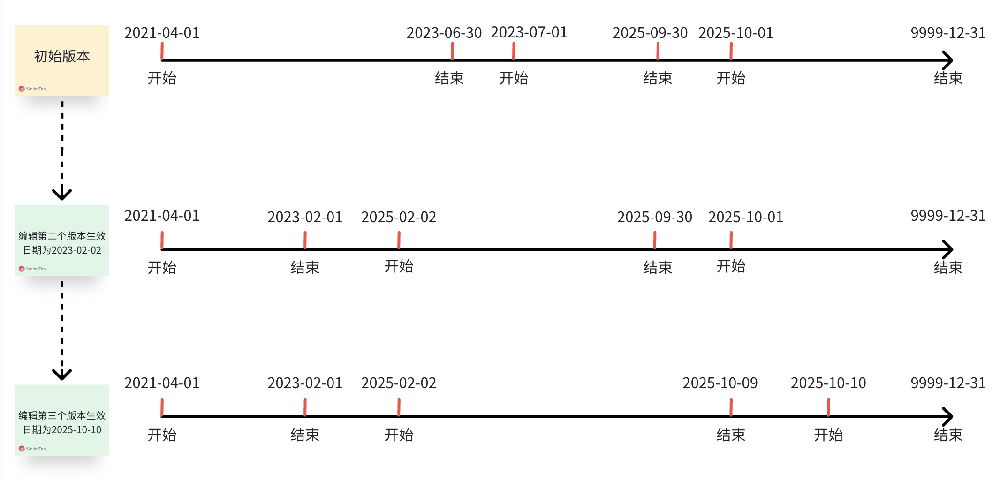

# 组织岗位需求功能

# **一、版本新增、编辑、删除**

1、每个版本失效日期不允许修改

2、新增一个版本的生效日期要按照当前所有历史版本生效日期进行对应插入：

- 第一个版本生效后，新增一个版本的生效日期不能早于第一个版本的生效日期，否则提示“生效日期不能早于第一个历史版本生效日期”

- 版本中间新增一个版本，将对应生效日期和结束日期分别插入其中，例如： 

3、删除版本：

- 第一个版本（生效日期最早）不允许被删除

- 删除最新版本，最新版本的上一个版本结束日期变为9999\-12\-31；同理，删除历史记录中间的一个版本的上一个版本结束日期自动变为被删除版本的结束日期，例如：

4、编辑版本：

- 生效日期不能更新到小于等于上个版本的生效日期

- 生效日期不能大于失效日期

- 生效日期更新发生变化，上个版本的结束日期要对应减一天
  
  例如：

# 二、组织机构新增、编辑、删除

1. 新增

新增组织机构时，字段“上级组织”可选择的有效组织（按初始版本生效日期）应该在新增组织机构的生效日期之前

例：新增组织机构A，最新生效日期2020\-10\-01

上级组织：

B，初始版本生效日期2025\-10\-01

C，初始版本生效日期2019\-10\-01

D，初始版本生效日期2018\-10\-01

则：上级组织能被选到的组织有C、D

2. 编辑

调整组织机构的生效日期不得晚于被关联的下级组织生效日期

3. 删除

- 无任何绑定职位、人员时，删除组织时，连同下面子节点也一并删除

- 组织绑定职位、人员情况：不允许进行删除！